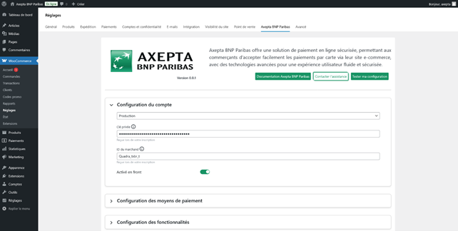
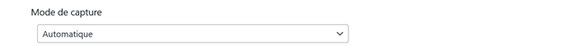
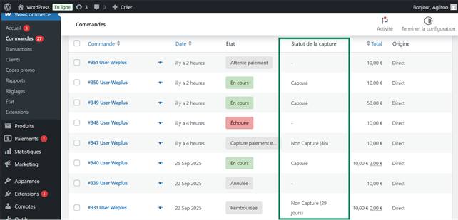
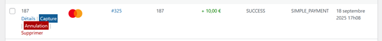
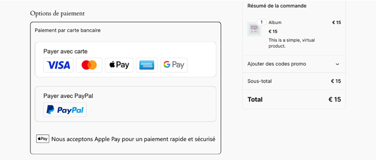

⬇️ Download

Download the latest version here:

[📥 Download Latest Release](../../releases/latest)

Each release includes:

ZIP package

RSA digital signature

> ⚠️ Security Warning: Only use this release if signature verification succeeds. A failed verification means the file may have been tampered with, you can check verification steps in release page.

📞 Support
📧 assistance.ecommerce@bnpparibas.com

# Document Axepta BNP Paribas WooCommerce

Objectif du document :

Regrouper tous les éléments relatifs à la refonte du module pour l’installation et l’utilisation du module.

## SOMMAIRE

- [Document Axepta BNP Paribas WooCommerce](#document-axepta-bnp-paribas-woocommerce)
  - [SOMMAIRE](#sommaire)
  - [INTRODUCTION](#introduction)
    - [PREREQUIS NECESSAIRES](#prerequis-necessaires)
    - [INSTALLATION DU MODULE](#installation-du-module)
        - [Installation via l'interface WordPress](#installation-via-linterface-wordpress)
        - [Installation via FTP/SSH](#installation-via-ftpssh)
    - [MISE A JOUR DU MODULE](#mise-a-jour-du-module)
  - [BACK OFFICE](#back-office)
    - [CONFIGURATION GLOBALE DU MODULE](#configuration-globale-du-module)
      - [CONFIGURATION DU COMPTE](#configuration-du-compte)
      - [CONFIGURATION DES MOYENS DE PAIEMENT](#configuration-des-moyens-de-paiement)
      - [Configuration des fonctionnalités](#configuration-des-fonctionnalités)
        - [MODE DE CAPTURE](#mode-de-capture)
    - [TABLEAU DES COMMANDES](#tableau-des-commandes)
      - [CAPTURE MANUELLE](#capture-manuelle)
    - [REMBOURSEMENT / ANNULATION](#remboursement--annulation)
      - [Remboursement](#remboursement)
      - [Annulation](#annulation)
    - [LOGS](#logs)
  - [FRONT OFFICE](#front-office)
  - [ESPACE CLIENT](#espace-client)

## INTRODUCTION

**AXEPTA BNP Paribas** vous donne accès à plusieurs moyens de paiement. Chacun d'entre eux propose une solution de paiement en ligne pour les e-commerçants.

Ces moyens de paiement couvrent actuellement le paiement simple.

Une librairie couvre les fonctions communes aux modules pour l’envoi des données vers la BNP Paribas.

### PREREQUIS NECESSAIRES

Vous devez disposer d'une installation WordPress fonctionnelle avec la version WooCommerce 10.0.3 ou supérieure. Assurez-vous également que votre site utilise un certificat SSL pour garantir la sécurité des paiements et que vous avez un accès FTP ou SSH à votre serveur pour télécharger et installer le plugin.  
  

### INSTALLATION DU MODULE

##### Installation via l'interface WordPress

Pour une installation rapide et simple, vous pouvez télécharger et installer le plugin directement depuis l’interface d'administration de WordPress. Suivez ces étapes pour le faire facilement.

1.      Téléchargez le fichier ZIP du plugin.

2.      Allez dans le tableau de bord WordPress, sous Extensions > Ajouter.

3.      Cliquez sur Téléverser une extension, puis sélectionnez le fichier ZIP du plugin.

4.      Cliquez sur Installer maintenant, puis activez le plugin après l'installation.

##### Installation via FTP/SSH

Si vous préférez une méthode manuelle ou si vous avez des restrictions sur l'interface WordPress, vous pouvez installer le plugin via FTP ou SSH en suivant ces étapes.

1.      Téléchargez le fichier ZIP du plugin et décompressez-le sur votre ordinateur.

2.      Connectez-vous à votre serveur via FTP ou SSH.

3.      Allez dans le répertoire **_« wp-content/plugins »_** de votre installation WordPress.

4.      Créez un dossier nommé **_« axepta-bnp-paribas »_**

5.      Copiez tout le contenu du plugin dézippé dans ce dossier.

6.      Allez dans l'interface WordPress, sous **_Extensions > Extensions installées_**, puis activez le plugin.

### MISE A JOUR DU MODULE

1.  Désinstaller totalement le module Axepta BNP Paribas
2.  Avant toute installation de la nouvelle version de votre module, nous vous invitons à bien désinstaller l’extension actuelle, à vider le cache de votre CMS et vérifier la suppression de l’extension en veillant à supprimer le répertoire d’installation du module sur votre serveur FTP.
3.  Installer la dernière mise à jour que vous avez téléchargé

> N.B. : La librairie est automatiquement mise à jour avec la mise à jour de plugin_

## BACK OFFICE

Pensez par la suite à remettre les paramètres de configuration Axepta Online dans chaque onglet du module. Il faudra remettre à nouveau votre MID( ID Marchand), votre clé d’activation pour remettre en production votre module

### CONFIGURATION GLOBALE DU MODULE
-------------------------------

Les fonctionnalités du module sont accessibles via le menu de gauche dans l'interface d'administration **_« WooCommerce > Réglages »_**. Pour débuter la configuration, cliquez simplement sur l'option **_« Axepta BNP Paribas »._**

La page de paramétrage fait apparaître plusieurs boutons sur le haut.

\-          **Documentation Axepta BNP Paribas :** lors du clic, l’utilisateur est renvoyé vers la documentation officielle hébergée par BNP Paribas

\-          **Contacter l’assistance :** Ouverture d’un formulaire pour l’envoi d’un mail vers l’assistance. Dans le mail les versions serveur, CMS et module sont automatiquement envoyées

\-          **Tester la configuration :** Permet d’afficher et de vérifier dans une fenêtre que la configuration du serveur est compatible avec le module installé.

#### CONFIGURATION DU COMPTE

La configuration du mode production et du mode test sont à faire pour activer le paiement en ligne.

Le mode démonstration ("DEMO") permet de tester le module sans paramétrage d’un MID (ID du marchant, fournit par BNP Paribas lors de l’inscription)

En mode Production, il est nécessaire de renseigner le MID et la clé privée.

En mode test, il est nécessaire de renseigner uniquement la clé privée. On utilise le MID de production auquel il a été ajouté un paramètre (\_t)

Sélectionnez le mode que vous souhaitez paramétrer pour voir apparaître les champs adéquats.

Pour pouvoir utiliser le module il est nécessaire de renseigner les paramètres suivants dans le formulaire

1.      Mode production :

·         MID (envoyé par BNP Paribas)

·         Clé privée (envoyée par BNP Paribas)

2.      Mode test :  
Le MID de production est utilisé par défaut avec l’ajout d’une chaine de caractère

·         Clé privée (envoyée par BNP Paribas)  

3.      Mode Démonstration  
Ce mode permet l’affichage de bandeau sur le site pour informer que ce mode est actif.  
Un MID spécifique est pré paramétré.  

4.      Activation en front  
Nécessaire pour afficher le module sur la page de checkout quel que soit le mode activé

5.      Afficher le logo ApplePay  
ApplePay est actuellement embarqué par la page de paiement. Cette option ne fait qu’apparaître le logo avec les moyens de paiement.  
  

Les éléments ne sont sauvegardés que lorsque l’utilisateur clique sur le bouton de sauvegarde

  

#### CONFIGURATION DES MOYENS DE PAIEMENT

Vous pouvez maintenant choisir les différents moyens de paiement à activer sur votre boutique.

Un onglet **_« Configuration des moyens de paiement »_** apparaît juste en dessous de **_« Configuration du compte »._** Cliquez dessus pour ouvrir la section et configurer vos moyens de paiement :

Tous les moyens de paiement intégrés à la librairie sont présentés ici. Il appartient au marchand de sélectionner les moyens de paiement qu’il a souscrit.  
La clé d’activation ne permet plus de définir les moyens de paiement.

1.      Organisation des paiements. Il s’agit de l’affichage des paiements qui a été décidé sur le checkout

·         Regroupé : Les bloc de paiement apparaissent. Il est possible de paramétrer les paiements en redirection et en iframe

·         HPP (Hosted Payment Page) : Seule la redirection est possible avec tous les moyens de paiement regroupés en un seul bouton. Affichage d’un bloc complet, pas de différenciation entre les cartes et les autres méthodes de paiement.

2.      Méthode d’affichage

·         Redirection : lors de la phase de paiement, l’utilisateur est renvoyé vers une page en fonction du moyen de paiement sélectionné

·         Iframe : lors de la phase de paiement, le formulaire est affiché en bas de la page de checkout en fonction du moyen de paiement sélectionné

3.      Label : Texte à afficher sur le bloc

4.      Liste des moyens de paiement.  
Sélectionner les moyens de paiement à afficher en checkout.

Note : Si CB- Visa-MasterCard est activé, le logo CB apparaîtra seulement si le pays de livraison de la commande est la France

5\. Personnalisation des moyens de paiement : permet le paramétrage des champs envoyés dans le formulaire de paiement lors de la redirection.

#### Configuration des fonctionnalités

Cliquez sur **_« Configuration des fonctionnalités »_** pour ouvrir la section dédiée. Vous y trouverez l'option pour choisir **_« le mode de capture des paiements »,_** vous permettant ainsi de définir comment les transactions seront traitées.

##### MODE DE CAPTURE

Cette option vous permet de choisir la méthode de capture du paiement :

*   Automatique (J) => La capture se fera automatiquement à minuit.
*   Différée (J+x) => Vous pouvez choisir le délai avant la capture (délai en heures : nombre entier compris en 1 et 696. Exemple pour 2 jours: saisissez 48)
*   Capture Manuelle

**Activation de la capture Automatique :**

Lors de la sélection capture automatique, les flux de paiement sont automatiquement capturés.

****

**Activation de la capture Différée :**

La capture différée est paramétrée avec un nombre d’heure avant la capture à réaliser.

****

Aucune action n’est nécessaire par le marchand pour réaliser la capture. Elle est confirmée par un flux retour (IPN).

**Activation de la capture Manuelle :**

Dans le menu de configuration du marchand, descendre jusqu’au champ « Capture » et sélectionner « Manual Capture ».

****

**Attention** : Sans action du commerçant, la transaction ne sera pas remise en banque. La capture d’une transaction au-delà du 7ème jour entraîne la perte de garantie associée au 3DSecure. Au-delà du 29ème jour l’autorisation accordée par l’émetteur ne sera plus valide. Il est donc préférable de capturer les opérations avant ces échéances.

### TABLEAU DES COMMANDES

Une nouvelle colonne intitulée "Statut de la capture" a été ajoutée à la liste des commandes dans WooCommerce. Cette colonne indique si la transaction de paiement a été capturée ou non. Si la capture n'a pas encore eu lieu, le temps écoulé depuis la demande de capture sera affiché.

De plus, un nouveau statut "Capture paiement en attente" a été ajouté aux statuts des commandes WooCommerce. Ce statut est uniquement attribué aux commandes pour lesquelles la capture du paiement n'a pas encore été effectuée. Il permet de différencier clairement les commandes en attente de capture de celles dont le paiement a déjà été finalisé.

#### CAPTURE MANUELLE

Pour capturer manuellement une transaction, suivez ces étapes :

1.      Accédez à « **WooCommerce > Transactions »** depuis votre tableau de bord WordPress.

2.      Vous verrez alors la liste des transactions effectuées.

3.      Lorsque vous survolez une ligne correspondant à une transaction qui n’a pas encore été capturée, un bouton **"Capture"** en bleu apparaîtra en dessous de cette ligne.

4.      Cliquez sur ce bouton pour effectuer la capture du paiement.

Une fois la capture effectuée, le statut de la transaction sera mis à jour pour refléter l’action.

**Notifications de capture manuelle**

Des notifications sont affichées lors de la tentative de capture manuelle d’un paiement, afin de vous tenir informé du statut de l’opération :

1.      Capture réussie : Une notification vous informe que la capture a été réalisée avec succès.

2.      Capture déjà effectuée : Si la transaction a déjà été capturée, une alerte vous indique que la capture ne peut pas être rééditée.

3.      Capture échouée : En cas d’échec de la capture, une notification détaillée explique la raison du problème et vous guide sur les étapes à suivre.

Ces notifications vous permettent de suivre précisément l’état de chaque transaction et d’agir en conséquence.

### REMBOURSEMENT / ANNULATION

#### Remboursement

Pour effectuer un remboursement suivez ces étapes dans WooCommerce :

1.      Allez dans **WooCommerce > Commandes** et cliquez sur la commande que vous souhaitez rembourser.

2.      Sur la page de la commande, vous trouverez les informations relatives à cette dernière.

3.      Vous verrez un bouton **"Remboursement"**. Cliquez dessus pour ouvrir la section de remboursement.

4.      Une fois la section ouverte, vous pourrez saisir le « **montant du remboursement »** ainsi que le **« motif du remboursement »** qui est facultatif.

5.      Après avoir rempli les champs, cliquez sur **« Remboursement X.XX € avec Axepta BNP Paribas »** pour procéder (X.XX est le montant saisi du remboursement) au remboursement. Le remboursement sera effectué si la commande a déjà été capturée.

**Remboursement total**

Pour un remboursement total, le montant (subtotal) est affiché et il suffit de laisser les valeurs prédéfinies vides et de valider (Refund Offline).

**Remboursement partiel**

Pour un remboursement partiel, il faut ajuster les valeurs des champs. Le champ "Ajustement Fee" permet de modifier la somme à retirer du remboursement.

Par exemple : Subtotal = 45, Ajustement Fee = 15, en cliquant sur “Update Totals” on obtient 30 comme remboursement pour l’acheteur.

**Annulation**

Si la transaction n'a pas encore été remise en banque (statut "processing" en cliquant sur l'orderID), une annulation est donc possible via **« Woocommerce > Transactions »**.

#### Annulation

Pour annuler une commande dont le paiement n'a pas encore été capturé, suivez ces étapes :

1.      Allez dans **WooCommerce > Transactions**.

2.      Recherchez la transaction associée au numéro de la commande que vous souhaitez annuler, et assurez-vous que la capture du paiement n'a pas encore été effectuée.

3.      Une fois la transaction localisée, cliquez sur le bouton **"Annulation"** pour annuler la commande.

### LOGS

Les logs sont activés en permanence. Pour les consulter ou les télécharger, allez dans **_« WooCommerce > État > Journaux »_** puis sélectionnez le log **_« axepta-bnpp »_**. Sur la page suivante, vous pourrez visualiser les logs et les télécharger en cliquant sur le bouton « **_Télécharger »_**.

## FRONT OFFICE

**Rendu sur la page de checkout**

Les moyens de paiement sont affichés sur un cadre prévu par bloc.

Les moyens de paiement supplémentaires sont accessibles en sélectionnant "Plus d'options de paiement", qui n’apparaît que le cas échéant.

**Rendu de la page de paiement en redirection**

**Rendu de la page de paiement en iFrame**

En affichage iFrame, un message est affiché pour demander à l’utilisateur de ne pas rafraichir la page au risque de perdre des éléments de session.

Note : En mode démonstration, un bandeau Orange apparaît avec la mention "**DEMO**"

ESPACE CLIENT
-------------

Les commandes affichent un bloc Axepta sur l’espace client.

